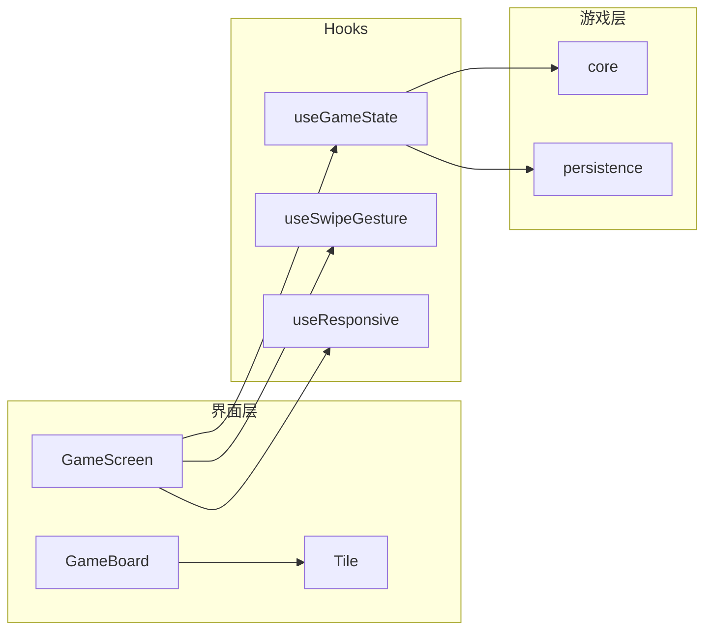

# React Native 2048 移动应用 — 完整计划

## 一、你的选择（已确认）

| 项   | 选择                 | 说明                                  |
| --- | ------------------ | ----------------------------------- |
| 脚手架 | **裸 React Native** | 不用 Expo，完整掌控原生工程                    |
| 持久化 | **完整**             | 保存最高分 + 当前棋盘/分数，支持恢复对局              |
| 动画  | **平滑**             | 使用 react-native-reanimated 做滑动与合并动画 |

---

## 二、技术栈与工具

- **运行时**: React Native (CLI，非 Expo)
- **语言**: TypeScript（严格模式）
- **格式与规范**: **Biome**（格式化 + 静态检查，替代 ESLint + Prettier）
- **手势**: react-native-gesture-handler（Pan 手势判定方向，新 API：`Gesture.Pan()` + `GestureDetector`）
- **动画**: react-native-reanimated（方块滑动、合并、新块出现）
- **持久化**: @react-native-async-storage/async-storage（高分 + 棋盘/分数快照）
- **响应式**: `useWindowDimensions` + Flexbox + 按宽度/高度比例计算棋盘与字体，支持手机/平板与横竖屏

---

## 三、项目结构（已实现）

```
ai-2048/
├── src/
│   ├── components/
│   │   ├── Board.tsx      → GameBoard (4x4 棋盘容器)
│   │   ├── Tile.tsx       → 单格方块（含 Reanimated 动画）
│   │   └── GameOver.tsx   → 游戏结束 / 胜利弹层
│   ├── game/
│   │   ├── core.ts
│   │   ├── types.ts
│   │   └── persistence.ts
│   ├── hooks/
│   │   ├── useGameState.ts
│   │   ├── useSwipeGesture.ts
│   │   └── useResponsive.ts
│   ├── screens/
│   │   └── GameScreen.tsx
│   ├── theme/
│   │   └── colors.ts
│   └── App.tsx
├── __tests__/
│   ├── App.test.tsx
│   └── game/core.test.ts
├── biome.json
├── jest.setup.js
├── PLAN.md
├── SCRATCHPAD.md
└── CONVO.md
```

---

## 四、核心实现要点

### 4.1 游戏逻辑（`game/core.ts`）

- 4x4 二维数组表示棋盘；每次有效移动后在一个空位随机生成 2 或 4。
- 四个方向：左/右/上/下 的「合并同一行/列相邻相同数字」逻辑可归一为：**先按行/列取出一维数组 → 单方向合并（去空、合并、补空）→ 写回**。抽成 `mergeLine(line: number[])` 与 `moveBoard(board, direction)`，便于单测。
- 胜负判定：无空位且任意方向都无法合并 → 游戏结束；出现 2048 可弹「胜利」并可选择继续玩。

### 4.2 手势与方向

- 使用 `react-native-gesture-handler` 的 **Gesture.Pan()**，在 `onEnd` 里根据 `velocityX/Y` 或 `translationX/Y` 判定主方向（左/右/上/下），阈值可调（例如位移 > 20 或速度 > 300）。
- 一次只处理一个方向，避免斜向误触。

### 4.3 动画（Reanimated）

- **新块出现**：新生成的块 scale 从 0.5 到 1 + 淡入（withSpring）。
- **合并**：合并时新块 scale 从 1 到 1.15 再回弹到 1（withSpring）。

### 4.4 响应式与多尺寸

- 使用 **useWindowDimensions** 在 `useResponsive` 中计算：棋盘边长 `min(width, height) * 0.85`，格子大小、字体按比例。

### 4.5 持久化（AsyncStorage）

- 键：`@2048/highScore`、`@2048/gameState`。
- gameState：存 `{ board, score }`；每次有效移动后写入；启动时若存在则 Alert「Resume last game?」。
- highScore：仅当 `score > highScore` 时写入。

### 4.6 布局与手势区域

- **布局**：头部（分数 + New Game）固定在上方；棋盘在下方 `flex: 1` 区域内垂直、水平居中。
- **手势区域**：`GestureDetector` 包裹整个游戏区域（含棋盘与下方空白），下方空白处滑动也可触发方向移动。

---

## 五、Biome 配置

- `biome.json`：recommended 规则，2 空格、单引号、行宽 100。
- 脚本：`lint`、`format`、`check`。

---

## 六、落地顺序（已完成）

1. 初始化项目（裸 RN + gesture-handler、reanimated、async-storage）
2. Biome 配置
3. 游戏逻辑 + 单测
4. 持久化 + 恢复 UI
5. UI 与响应式（useResponsive、GameBoard、Tile、useGameState、手势）
6. 动画（Tile 出现/合并）
7. 收尾（GameOver、高分、New Game、PLAN/SCRATCHPAD/CONVO.md）

---

## 七、架构示意


